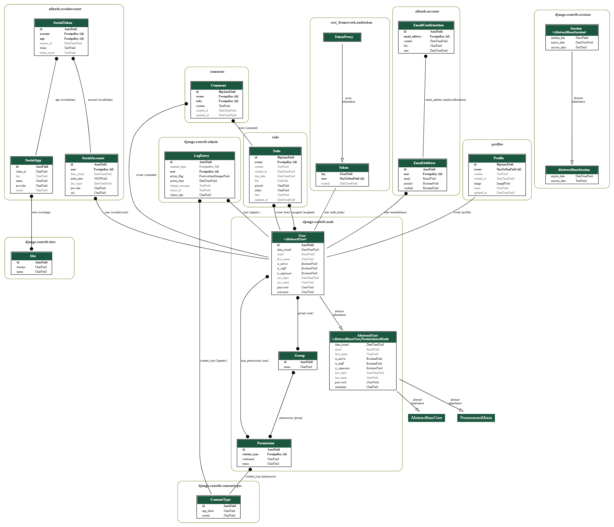

# Todo rest Backend

Todo Backend is an rest API  backend for todo projects. It lets users create accounts, login, create todos, and edit or remove them. 

# Features

## Todo

- A user can create a todo with the following information
    - Title 
    - Status
    - Content
    - Priority
    - File
    - Assigned
    - Due date

- When a api request is called for todos this is the information that returns:
    - id
    - owner
    - created_at
    - updated_at
    - title
    - status
    - content
    - priority
    - is_owner_or_assigned (returns true or false)
    - file
    - assigned(returns id of the assigned)
    - assigned_username
    - profile_id
    - due_date
    - due_date_has_passed (returns true or false)

- The following urls can be used to acces todos "/todos" for all the todos or "/todo/id" where it returns a single todo, replace "id" with the appropiate id. 

- Todos can be filterd with the fields stated below, to filter in an api request simply add "?owner=1&status=in_progress" to the API todos url
    -   owner
    -   assigned
    -   status
    -   priority

- And it can also be sorted by every filed, ascending or descending.\
To do this, add "?search=searchvariable" to the api or "&search=..." if you already has made some filters.

## Comments

- A user can comment on a todo, mostly to add work notes to them or to add comments to other people assigned to the todo.

- A comment is saved with the following information
    - todo assinged
    - content

the information returnd if called from the API is the following.
    - content
    - todo (todo id number)

- The following urls can be used to acces comments "/comments" for all the comments or "/comment/id" where it returns a single comment, replace "id" with the appropiate id. 

## Profiles

- A user can create a profile with the following information
    - username
    - password1
    - password2

- When a api request is called for todos this is the information that returns:
    - content
    - created_at
    - id
    - image
    - is_owner
    - name
    - owner (username from the user model, more on this connection below)
    - updated_at

- The following urls can be used to acces profiles "/profiles" for all the profiles or "/profile/id" where it returns a single profile, replace "id" with the appropiate id. 

- User handling is made with dj-rest-auth on the /dj-rest-auth url. More about this can be read [here](https://dj-rest-auth.readthedocs.io/en/latest/).

# Testing

- Tested to send data that is required to the API and make sure it doesn't accept it.

- Tried to send data to URLs that doesn't exist. Comes back with a 404 error, this is because no url to base is made 

- Tried to access the base URL only. This also returns a 404 error, this is because that no base url was made. I chose to do this because the only urls that it is gonna be used is already in place.

- Tested to save data as a non owner for the todos, comments, and profiles.

## Solved Bugs

When deploying the application to heroku there were multiple bugs that arose.

- First the application didn't deploy, this was due to a compatability error with the backports.zoneinfo package.
This was fixed by adding “backports.zoneinfo==0.2.1;python_version<"3.9" in the requirements.txt instead of “backports.zoneinfo==0.2.1"

## Remaining Bugs

- There are no known bugs remaining.

# Validator Testing
I used automatic PEP8 refactoring. This was used by following a guide on [stack overflow](https://stackoverflow.com/questions/14328406/tool-to-convert-python-code-to-be-pep8-compliant)

No errors when passing through the PEP8 validator.

There are some warnings left in the settings file, this is due to lines being to long but can't be broken up.

# Deployment

To deploy the project to heroku, do the following

1. Create a app in heroku.
2. sign up at [Elephant SQL](https://www.elephantsql.com/)
3. Create a new instance with tiny turtle as a plan and the appropiate region.
4. Go in under details for the and copy the URL and save it somewhere temporarily
5. Login to Cloudinary or create a Cloudinary account.
6. Go to the Cloudinary dashboard. Copy the API "Environment variable" and save it somewhere temporarily.
7. In your Heroku app, go in to settings and click on "Reveal Config Vars"
8. Click on "Add", in the key field write "CLOUDINARY_URL" and in the value field enter the "Environment variable" from cloudinary that was saved from before
and delete the "CLOUDINARY_URL=" part. 
9. Click on "Add", in the key field write "DATABASE_URL" and in the value field enter the URL from Elephant SQL that was saved from before
10. Click on "Add", in the key field write "SECRET_KEY" and in the value field enter a custom key. I used [this](https://djecrety.ir/) site to make mine.

Now all the settings is done on heroku. If your site is on Github, in the Heroku app go in to "Deploy" and connect your github account and project.
Lastly scroll down and click on "Deploy Branch" and make sure "main" is selected.

To continue to develop the site you must set up de development environment. 
To do this, create a new file named env.py in the projects root directory in the development environment. Make sure this file is not on github and in your gitignore file.
In the env.py file import os, and write the code as stated below.

"import os

os.environ["DATABASE_URL"] = THE_POSTGRES_KEY FROM BEFORE

os.environ["SECRET_KEY"] = THE_SECRET_KEY

os.environ["CLOUDINARY_URL"] = THE_CLOUDINARY_KEY_WITHOUT_THE_CLOUDINARY_URL=_part."

# Model designs 

The Comment and Profile models i had alot of help from [Code institute](https://codeinstitute.net/) to make.

These were the models i had in mind when creating the project.

- Todo-model: 
    - title
    - content 
    - status
    - priority
    - owner 
    - created_at 
    - updated_at
    - file 
    - assigned
    - due_date

- Comment:
    - owner
    - todo
    - created_at
    - updated_at
    - content

- Profile:
    - owner
    - created_at
    - updated_at
    - name
    - content
    - image

# Database structure

# Credits

- The solution to the deployment bug on Heroku is found [here](https://stackoverflow.com/questions/71712258/error-could-not-build-wheels-for-backports-zoneinfo-which-is-required-to-insta)
- [Code institute](https://codeinstitute.net) with help on the project 

